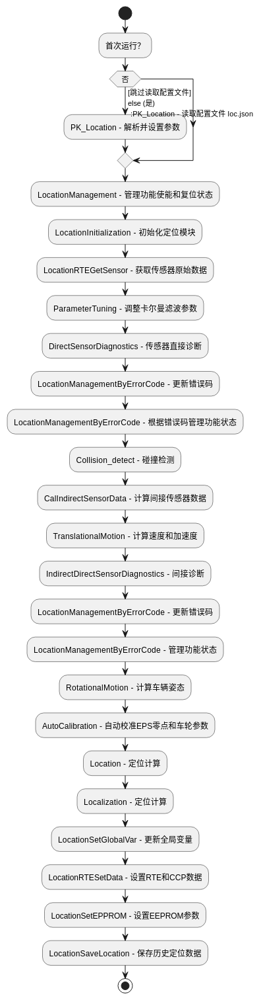

# 📍 LOCATION

## 🧭 模块概述（Overview）

* **功能简介**：
  融合多传感器数据进行车辆定位

* **应用场景**：
  车辆上电即启动

* **术语缩写**：
  | 术语                    | 全称      | 说明              |
  | -------------------------- | -------- | -----  |
  | LC  | location | 定位  |
  | EKF  | Extended Kalman Filter | 扩展卡尔曼滤波器  |
---

## 📂 目录结构（Directory Structure）

```plaintext
├── bicycleMotionModel #一个车辆模型的简单测试代码
├── Eigen
└── kalman
```

---

## ⚙️ 编译与依赖（Build & Dependencies）

* **平台**：<Linux/Android>
* **编译器**：<gcc-11.4.0/ndk-r26b>
* **构建系统**：
  * [ ] CMake
* **apa依赖库**：
  * [libcommon.so](../../apa_include/lib/x86/libcommon.so)
* **三方依赖库**：
  * jsoncpp
  * Eigen
  * protobuf
* **产物**：
  * [liblocation.so](../../apa_include/lib/x86/liblocation.so)
---

## 🧩 接口说明（Interfaces）

* **函数调用接口**：  参见：
  [PK_Location.h](../../apa_include/include/apa_location/PK_Location.h)
  | 接口名称                    |  描述说明              |
  | -------------------------- | -----  |
  | `PK_Location()`            | 主流程函数，定位模块运行入口|
  | `PK_PreLocation()`       | 定位同步|


* **模块输入接口**：

  | 接口名称                    |  描述说明              |
  | -------------------------- | -----  |
  | `RTE_BSW_Get_xxx()` |  系统相关输入接口 |
  | `RTE_PK_Location_Get_xxx()`   |  Location模块相关输入    |
  | `RTE_PK_SlotDetect_Get_xxx()`| SlotDetect模块相关输入    |
  | `RTE_PK_StateManage_Get_xxx()`| 状态机模块相关输入    |


* **函数输出接口**：

| 接口名称| 描述说明|
| --------------------------------------------- | ---------------------------- |
| `RTE_PK_Location_Set_CurPos_With_Timestamp()` | 输出车辆的当前位置，包含精确时间戳（如 GPS 时间或系统时间），用于时序同步      |
| `RTE_PK_Location_Set_CurPos()`| 输出当前位置的简化版本，可能不含时间戳，供本模块内部或状态监控使用            |
| `RTE_PK_Location_Set_ModuleState_Location()`  | 输出定位模块当前状态，例如是否初始化成功、当前精度等级、融合状态等            |
| `RTE_PK_Location_Set_Vel_MoveMentSt()`| 输出当前运动状态（如静止、匀速、加速、倒车等），用于车辆行为判断             |
| `RTE_PK_Location_Set_Vel_Spd()`| 输出当前速度信息，可能是融合后的瞬时速度（m/s）                    |
| `RTE_PK_Location_Set_Vel_TrajCurve()`| 输出当前运动轨迹的曲率值（代表车辆转弯程度），用于路径规划和控制             |
| `RTE_PK_Location_Set_Vel_Yawrate()`| 输出车辆的偏航角速度（车辆转弯时的角速度，单位 rad/s），通常来自 IMU 或融合值 |
| `RTE_PK_Location_Set_Vel_SpdFiltered()`| 输出经过滤波处理的速度（去除噪声、震荡后更平滑的速度值）|
| `RTE_PK_Location_Set_Vel_Pitch()`| 输出车辆的俯仰角或俯仰变化率（用于坡道感知或姿态修正）|


---

## 🔁 核心模块流程图（Flowchart）


* **主函数**：PK_Location

  ```

---

## 🧠 核心算法描述（Core Algorithms）

### 1. 融合算法（多传感器融合）

* 使用 Kalman 滤波框架融合轮速、IMU、EPS、ESC 信息。
* 滤波过程考虑静止偏差、动态误差模型以及车辆运动约束。
* 对抗 IMU 漂移与误差累积采用多路径容错机制（方向盘角速度与轮速辅助修正）。

### 2. 定位过程

* 先根据轮速与方向盘角计算车辆姿态变化。
* 再积分得到速度、加速度，并计算轨迹曲线。
* 最后通过融合位移/角度/方向修正当前位姿（位置 + 姿态）。

### 3. 自动校准机制

* 在低速稳定状态下统计方向盘零偏、轮速/ESC 误差因子。
* 实现动态更新校准参数以提升定位准确性。

---

## ✅ 模块验证（Verification）

* 已通过模块级单元测试（见 test/）
* 可通过回放工具验证定位效果
* 已对关键路径进行时间开销分析与稳定性测试

---

## 📞 修改日志（Changelog）

|Date| Version  |Author| description|
| -------------------------- | -------- | -----  |-----  |
| 2025.07.21 | 0.0.1 | 刘建冬  | 第一版 |

